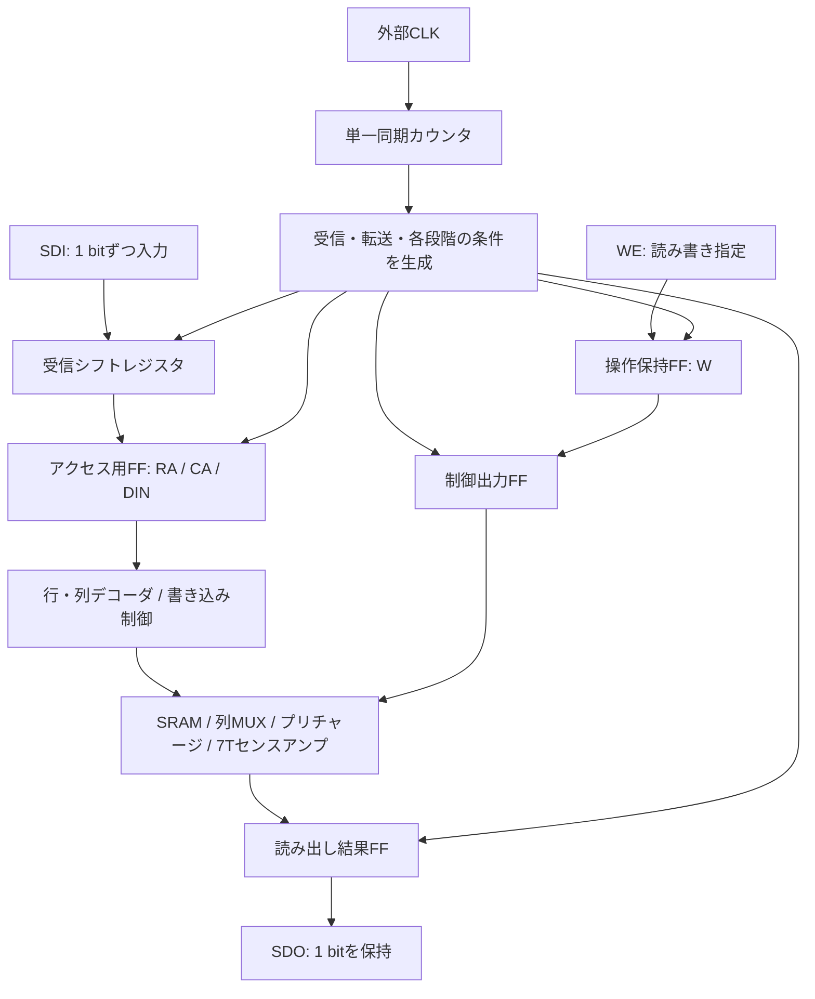

# シリアルSRAM制御仕様

2026-09-11確定。外部CLKだけでシリアル受信から読み書き完了まで進める、電源込み7ピンの仕様。制御部はVerilog RTLで記述し、状態表とテストベンチの基準にする。

この文書は以前の設計案を全面的に置き換える。論理仕様は確定しているが、本仕様のRTL・回路図・統合検証は未実装。既存回路の扱いと今後の実装範囲は末尾に記す。

## 1. 基本構成

- 1回の操作で、指定した1セルに1 bitを書き込む、または読み出す。
- アドレスと書き込みデータをSDIから1 bitずつ、CLK立上りごとに受信する。
- 単一の同期カウンタで、受信からE0〜E7までを順に進める。
- START、LOAD、BUSYの外部ピンは設けない。独立した内部STARTや開始待ち状態も設けない。
- 受信長と操作長は固定。読み出しでも書き込みと同じ数のクロックを送る。
- 読み出し結果は1 bitのFFに保持してSDOへ出す。出力シフトレジスタは不要。
- 電源投入後にRESETで受信位置を初期化する。正常な連続操作では毎回のRESETは不要。



図はデータと制御の流れ。CLKはカウンタだけでなく全FFへ共通に接続する。RESETも全制御FFへ接続する。

## 2. 外部ピン

| ピン | 方向 | 仕様 |
|---|---|---|
| VDD | 電源 | 5 Vを設計・検証の基準とする |
| VSS | 電源 | GND |
| CLK | 入力 | 全FFの共通クロック。立上りで受信・手順を進める |
| RESET | 入力 | HIGHで非同期初期化。CLKを送らなくても有効 |
| SDI | 入力 | 行アドレス、列アドレス、DINの順に直列入力 |
| WE | 入力 | 1=書き込み、0=読み出し。E0で内部Wへ保持 |
| SDO | 出力 | 最後に完了した読み出しの1 bitを保持。RESETで0 |

合計7ピン、うち信号5ピン。アドレスを拡張してもピン数は変わらない。WEと内部WRITE_ENは別信号であり、WEを直接プルダウン回路へ接続しない。SDOは常時駆動する論理出力とし、三態制御は設けない。パッド・ESD・外部負荷用の出力段は物理実装時に追加・評価する。

## 3. アドレス幅と送信形式

`ROW_BITS`、`COL_BITS`を、それぞれ1以上の実装時パラメータとする。配列は `2^ROW_BITS` 行、`2^COL_BITS` 列。送信中に幅を変更する機能は設けない。

```text
受信長 N = ROW_BITS + COL_BITS + 1
1操作のCLK立上り数 = N + 8
カウンタ幅 = ceil(log2(N + 8))
```

SDIの送信順は、行アドレスのMSBからLSB、列アドレスのMSBからLSB、最後にDIN。

```text
RA[ROW_BITS-1], ..., RA[0], CA[COL_BITS-1], ..., CA[0], DIN
```

読み出しでもDINの位置を省略せず、0を送る。回路はその値を取り込むが、読み出し操作には使用しない。WEはこの直列データに含めない。

| 配列 | ROW_BITS | COL_BITS | 受信長N | 1操作の立上り数 | カウンタ幅 | 読み出し幅 |
|---|---:|---:|---:|---:|---:|---:|
| 2×2 | 1 | 1 | 3 | 11 | 4 bit | 1 bit |
| 16×16 | 4 | 4 | 9 | 17 | 5 bit | 1 bit |
| 32×32 | 5 | 5 | 11 | 19 | 5 bit | 1 bit |

N bitのシフトレジスタは受信段階にだけ、以下の向きに更新する。

```verilog
shift_reg <= {shift_reg[N-2:0], SDI};
```

N回受信した後の内容は次の配置になる。

```text
shift_reg[N-1 : COL_BITS+1] = RA
shift_reg[COL_BITS : 1]     = CA
shift_reg[0]               = DIN
```

受信中はアクセス用RA/CA/DIN/Wを保持する。シフト途中の値はデコーダへ渡さない。前回の受信内容は次のN回のシフトで全て置き換わるため、操作ごとのシフトレジスタ消去は不要。

## 4. カウンタと状態遷移

`count`は「次のCLK立上りで実行する手順の番号」。以下の表は必ず立上り直前のcountで読む。立上りで、その番号の処理とカウンタ更新を同時に行う。

| 条件 | カウンタの動作 |
|---|---|
| RESET=1 | 非同期で0へ戻す。全保持値も初期化 |
| RESET=0、0 <= count < N+7 | CLK立上りでcount+1 |
| RESET=0、count=N+7 | E7を実行し、CLK立上りで0へ戻す |
| RESET=0、count>N+7 | 次のCLKで0へ戻し、制御出力を非アクセス値へ戻す |

未使用符号から戻る際は、受信・アクセス内容転送・読み出し結果取り込みを行わない。これは誤動作中のメモリ内容を保証する機能ではない。正常動作ではRESET後に未使用符号へ入らない。

```text
RESET → count=0

受信0 → 受信1 → ... → 受信N-1 → E0 → E1 → ... → E7
  ↑                                                        │
  └──────────────── 次の操作 ──────────────────────────────┘
```

`count == N` がE0の処理条件になる。別のSTARTパルス、START保持FF、受信専用カウンタ、アクセス専用カウンタは作らない。各条件を組み合わせ論理で作り、対応するFFの更新を選ぶ。

## 5. 受信からE7までの動作

| 立上り直前のcount | 手順 | その立上りでの更新・直後の動作 |
|---|---|---|
| 0〜N-1 | 受信 | SDIを1 bitシフト。SRAMへのアクセスは行わない |
| N | E0 | 受信済みRA/CA/DINと外部WEをアクセス用FFへ保持。全BL/BLBと共通線Y/YBをプリチャージ。読み出しならSA入力を接続して初期化 |
| N+1 | E1 | プリチャージ解除。充電用PMOSがOFFになる時間を取る |
| N+2 | E2 | 書き込みならWRITE_ENを上げ、片側プルダウン開始 |
| N+3 | E3 | WL_ENを上げ、選択行へのアクセス開始 |
| N+4 | E4 | 読み出しならSAEを上げて判定。書き込みならそのまま継続 |
| N+5 | E5 | WL_ENを下げる。書き込みのプルダウンは維持 |
| N+6 | E6 | WRITE_ENを下げる。読み出しならSOUTを読み出し結果FFへ保持 |
| N+7 | E7 | 操作完了。非アクセス値を維持し、count=0へ戻す |

E0では `W <= WE` と同時に、今回のWEからSAの動作を決める。直前の操作のWを使ってE0のSAEを決めない。

最後の受信とE0は別のCLK立上りとする。同じCLKで動くFFは更新前の値を取り込むため、最後のbitを受信した次の立上りで、全bitが揃ったシフトレジスタをアクセス用FFへ転送する。

### 2×2での外部操作例

行1・列0へ1を書き込む場合、最初の3回でSDIに `1, 0, 1` を送る。WEはE0の前後で1に保つ。

| 外部から数えた立上り | 直前のcount | 動作 |
|---|---:|---|
| 1 | 0 | RA=1を受信 |
| 2 | 1 | CA=0を受信 |
| 3 | 2 | DIN=1を受信 |
| 4 | 3 | E0：操作内容を保持・プリチャージ |
| 5〜10 | 4〜9 | E1〜E6 |
| 11 | 10 | E7：操作完了・count=0 |
| 12 | 0 | 次の操作のRAを受信 |

同じセルを読む次の操作では、SDIに `1, 0, 0` を送り、E0でWE=0とする。E7後にSDO=1を確認する。読み出し結果は次のCLKでシフトアウトするものではなく、1 bitの電圧として既に出ている。

## 6. 制御出力の真理値表

表の値は、その手順のCLK立上り後、FF出力が落ち着いたときの値。カウンタ自体は既に次の手順番号になっている。更新後のcountを生デコードした値とは区別する。

`P`はPREBとYPREBの共通値で、0=プリチャージON。`W`はE0で保持した操作指定。E0の行だけは、同じ立上りで取り込む外部WEを使う。

| 手順 | P | WRITE_EN | WL_EN | SAE |
|---|---:|---:|---:|---:|
| RESET・受信・E7・未使用符号からの復帰 | 1 | 0 | 0 | 1 |
| E0 | 0 | 0 | 0 | WE |
| E1 | 1 | 0 | 0 | W |
| E2 | 1 | W | 0 | W |
| E3 | 1 | W | 1 | W |
| E4 | 1 | W | 1 | 1 |
| E5 | 1 | W | 0 | 1 |
| E6 | 1 | 0 | 0 | 1 |

PREB/YPREB、WRITE_EN、WL_EN、SAEはFFで保持する。カウンタの複数bitの遷移によるデコードグリッチを、アナログ回路へ直接渡さない。RTLでは立上り前のcountに対する処理で、カウンタと制御出力FFを同時に更新する。表からさらに1周期遅らせない。

書き込み前にもローカル線と共通線をプリチャージする。SAEは書き込み中ずっと1なので、センス内部のプリチャージは行わない。読み出しではE0〜E3でSAE=0にし、入力接続・初期化・信号追従を行い、E4で入力を切り離して再生判定する。SAE=1はSA内部を0に消去する意味ではない。

## 7. デコーダ・書き込み回路との接続

RA/CA/DIN/WはE0以外で保持する。アドレスが変わるE0では全WLがLOW、両プルダウンがOFFで、プリチャージを開始する。列選択が落ち着き、必要な充電が完了してからE1でプリチャージを切る。

2×2では次の関係を維持する。

```text
WL0   = !RA & WL_EN
WL1   =  RA & WL_EN
COL0  = !CA
COL1  =  CA
PD_Y  = !DIN & WRITE_EN
PD_YB =  DIN & WRITE_EN
```

列はCA安定時に常に1列選択。COL_ENは設けない。アドレス遷移中の一時的な複数列接続は、WLと書き込み駆動がOFFの期間に収める。受信中も前回の列選択を保持する。

アレイ拡大時はアドレス幅に合わせてデコーダを拡張する。nMOS列MUX、共通の片側プルダウン、共通の7Tセンスアンプで1セルずつアクセスする方針は同じ。デコーダや配線の負荷増加に応じて出力段とCLK周期を評価する。

## 8. 非同期RESETと保持値

RESETはHIGH有効、CLKより優先。アサート時はCLKなしで全デジタル保持値を0へ戻す。初期値を作るためだけのCLKは不要。

| 保持値 | RESET時の値 | 更新する手順 |
|---|---:|---|
| count | 0 | 各CLK立上り |
| shift_reg | 0 | 受信のみ |
| RA / CA / DIN / W | 0 | E0のみ |
| READ_DATA | 0 | 読み出しのE6のみ |
| PC_ON | 0 | 制御表に従う。PREB=YPREB=!PC_ON |
| TRACK | 0 | 制御表に従う。SAE=!TRACK |
| WRITE_EN / WL_EN | 0 | 制御表に従う |

スタセル化ではDFFRを基本にする。PREB/YPREBとSAEは、内部に反対の意味を保持してQBから出す。これによりQの初期値は全て0で統一でき、DFFRに1へのプリセット機能を要求しない。RTLでもPC_ONとTRACKを0にリセットして反転出力する形で表現する。実際のQB利用への割り当てはスタセル化時に確認する。

RESET直後はPREB=YPREB=SAE=1、WRITE_EN=WL_EN=0、SDO=0。列デコーダはCA=0に応じて列0を選ぶが、全WLはLOWで書き込み駆動はOFF。

RESETはSRAMセルを消去しない。電源投入後、まだ書き込んでいないセルの読み出し値は未定義。アクセス中のRESETは中断として扱い、その中断によるメモリ内容は保証しない。

外部はCLKをLOWで停止してRESETを解除し、リセット解除から最初のCLK立上りまで、実装が要求する回復時間を確保する。SDIの先頭bitもその最初の立上りに間に合わせる。この外部タイミング規則を前提に、解除同期用の追加クロックはプロトコルへ入れない。RESETの最小パルス幅・解除間隔は実セルで確認する。

## 9. 外部タイミングと出力の扱い

- SDIは受信CLK立上りの前後でセットアップ／ホールド時間を満たす。基本はCLK立下り側で切り替える。
- WEはE0の前後でセットアップ／ホールド時間を満たす。操作全体で一定にしてよい。E0後のWE変化はその操作へ反映しない。
- E0〜E7中はSDIを無視する。CLKは手順を進め続ける。
- READ_DATAは読み出しのE6でだけ更新し、SDOへ出す。RESET以外では、書き込み・受信・次回のプリチャージで変えない。
- 外部の結果観測時点は読み出しのE7後とする。E6からのFF・出力バッファ・負荷の遅延も満たすこと。
- E7後、および受信中はCLKをLOWで止めて待てる。アクセス用アドレスと非アクセス出力を保持する。
- E0〜E7は同じCLK周期で進め、書き込みでもE4などの段階を省略・短縮しない。アクセス途中での任意長停止は仕様に含めない。
- クロックを連続供給すれば、E7の次の立上りから次の操作の受信が始まる。入力が不要な単なる空クロックという扱いにはしない。
- 余分なCLKや不足したCLKは送受信の位置ずれになる。自動検出・自動再同期は設けず、RESETで受信先頭へ戻す。

CLKは外部から供給し、内部発振器は作らない。全FFを共通CLKで駆動し、保持／更新はD入力側の論理・MUXで選ぶ。単純なANDによるCLKゲーティングとリップルカウンタは使わない。

検証の開始条件は5 V・27℃・CLK周期100 ns。既存アナログ回路の追加容量は2×2の各ローカル線10 fF、共通線100 fFを引き継ぐ。これらは抽出値ではない。

本仕様の制御で論理上WL_ENがHIGHなのはE3→E5の2周期、書き込み駆動はE2→E6の4周期。読み出しのSAE立上りから結果取り込みまではE4→E6の2周期。実際のWL・PD・ビット線・SOUTの遅延を含めて成立することを統合検証する。

100 nsは最短周期や製品保証値ではない。配列の拡大、配線抽出、電源・温度・素子ばらつきを反映したタイミング値は実装後に確定する。論理プロトコルを変えずにCLK周期を調整する。

## 10. Verilogでの記述と検証

制御部のRTLには、パラメータ化した受信シフトレジスタ、単一カウンタ、アクセス用FF、制御出力FF、読み出し結果FFを記述する。受信回路とアクセス回路の間に別のSTARTハンドシェイクは作らない。

FF更新は共通のCLK立上りと非同期RESET、ノンブロッキング代入で記述する。保持条件はクロックイネーブルとして表現し、必要なMUXはスタセル化で実現する。論理合成を使うか手でゲートへ対応付けるかは実装手段であり、上記の動作仕様は共通とする。

デジタルTBはSDI/WE/CLK/RESETから操作し、SRAM部分の動作モデルと期待メモリを使ってSDOを照合する。内部信号は状態と制御順序の検証にも使う。SRAMモデルは未書き込みセルを初めから0と仮定しない。

最低限、以下を自動判定する。

1. CLKなしの非同期RESETで全デジタル保持値と非アクセス出力が初期化され、解除後の最初の立上りが受信0になる。
2. 各アドレス幅でMSB先行の受信とRA/CA/DINへの分割が正しい。E0より前にアクセス用FFは変わらない。
3. 全手順のカウンタ・制御出力・保持／更新が表と一致する。E7から受信0へ追加クロックなしで戻る。
4. E0後にSDIとWEを変更しても実行中の操作に影響しない。WEはE0で今回の値を使い、読み書きを交互にしても正しい。
5. 全4セルに両方の値を書き、読み出し結果をSDOで確認する。他セルの内容は変わらない。
6. READ_DATAは読み出しのE6で更新し、受信・書き込み・次回プリチャージでは保持する。
7. 連続操作、操作間のCLK停止、受信途中の停止・再開、受信途中のRESETで受信位置が仕様どおりになる。
8. アクセス中のRESETで制御が解除される。中断したメモリ内容の一致は要求せず、必要なセルへ再書き込みして以後の動作を確認する。
9. 2×2に加え16×16・32×32相当のパラメータでも、フレーム長・アドレスの取り違え・カウンタの折り返しを確認する。

その後、実スタセルと既存2×2アナログ回路を接続したSPICE TBで、実WL/PDの順序、プリチャージ、センス判定、非選択セル保持、FFのセットアップ／ホールド、RESET動作を確認する。RTLのPASSはアナログ動作の保証を意味しない。

## 11. 既存回路の扱いと実装範囲

本仕様を実装する順序は、制御RTLとデジタルTBの作成・検証、スタセル回路への反映、既存2×2とのSPICE統合検証、レイアウトとDRC/LVS・抽出後検証とする。

以前の並列入力・START受付・同期RESETのシーケンサー、保持レジスタ、専用TBの回路図・シンボルは削除した。それらに依存する専用検証スクリプトと操作一覧も削除した。旧実装はGit履歴で参照できる。

| 残す回路・TB | 本仕様での利用 |
|---|---|
| `row_decoder_1to2.sch` / `.sym` | 保持したRAとWL_ENを入力する |
| `col_decoder_1to2.sch` / `.sym` | 保持したCAを入力し、安定時に常に1列を選択する |
| `write_control.sch` / `.sym` | 保持したDINとWRITE_ENから両プルダウンを制御する |
| SRAMセル・列MUX・プリチャージ・7Tセンスアンプ | 既存の2×2構成を接続し、新制御で再検証する |
| `sram_tb_array_write_control.sch` | シーケンサーを追加する前の、既存2×2と周辺回路の検証基準 |

新しいシーケンサー、シリアル受信回路、非同期RESET対応の保持回路、専用TBは本仕様に従って作成する。既存回路のPASS実績を本仕様の検証結果としては扱わない。

今回行ったのは設計文書の全面改訂と旧シーケンサー実装の削除。新仕様のRTL・回路図・TBは未作成であり、本仕様の統合検証は未実施。
