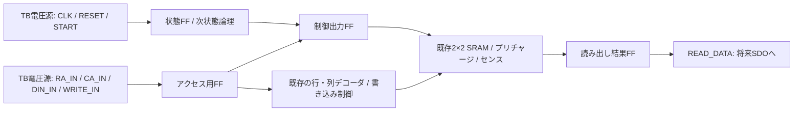
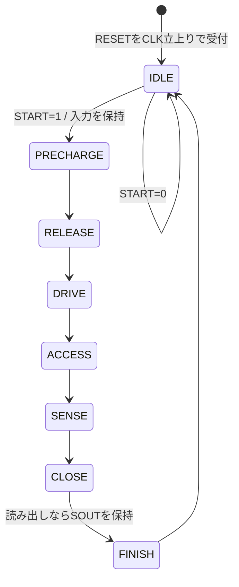

# SRAMアクセスシーケンサ設計案

2026-09-11。状態遷移・信号仕様の設計段階。シーケンサの回路図、レイアウト、シミュレーションはまだ作成・実行していない。既存の `sram_tb_array_write_control.sch` で検証したアクセス順序を、外部CLKに同期する8状態へ置き換える案。

## 最初の検証範囲

シフトレジスタの代わりに、TBの理想電圧源から `RA_IN`、`CA_IN`、`DIN_IN`、`WRITE_IN`、`START` を与える。全入力の立上り・立下りには有限時間を設ける。CLK、RESETもTBから与える。

アクセス用FF、状態FF、制御出力FF、読み出し結果FFは実スタセルで作る対象とする。RA/CA/DINをデコーダや書き込み制御へ直接与えて、アクセス用FFを省略するものではない。将来シフトレジスタを追加したら、入力の供給元と開始受付を置き換える。

## 入力・保持信号

| 信号 | 意味・扱い |
|---|---|
| CLK | 全FFの共通クロック。立上りで更新。リップルカウンタは使わない |
| RESET | 初回TB用の内部初期化入力。HIGHのCLK立上りで同期初期化し、他の動作に優先 |
| START | 待機中のCLK立上りでHIGHなら開始受付。TBでは1クロックのパルス。動作中は無視し、保留しない |
| RA_IN / CA_IN | 開始時に取り込む行・列アドレス。2×2では各1 bit |
| DIN_IN | 開始時に取り込む書き込みデータ1 bit。読み出しでも取り込むが使わない |
| WRITE_IN | 開始時に取り込む操作指定。1=書き込み、0=読み出し |
| RA / CA / DIN / W | アクセス用FFの出力。開始受付時だけ更新し、次の受付まで保持 |
| READ_DATA | 読み出し結果FFの出力。読み出し完了時だけ更新し、書き込みでは保持 |

RESETは7ピン案に新しい外部ピンを追加する決定ではない。最初はシーケンサ単体を確実な状態から試すためTBに設ける。実機の初期化をLOADによる手順または電源投入リセットでどう実現するかは、別途決める。

初期化後の出力は、状態=000、PREB=YPREB=SAE=1、WRITE_EN=WL_EN=0、RA=CA=DIN=W=READ_DATA=0。SRAM記憶セルの初期内容は保証しない。操作中のRESETは中断扱いで、そのアクセスの書き込み結果は保証しない。最初のTBでは起動時にだけ使用する。

STARTを待機に戻るまでHIGHのまま保持すると再受付する仕様。初回TBでは必ず1パルスにする。将来LOADに接続する際は、パルス化または再受付防止の仕様を決める。

## 状態遷移

各矢印はCLK立上り1回。RESETは図のどの状態でもIDLEへ戻す。通常動作は1状態1周期。読み書きで同じ経路を通る。

## 次状態の真理値表

Q2:Q0は現在状態、D2:D0は次のCLKで状態FFへ入れる値。Xはどちらでもよい。

| RESET | Q2 Q1 Q0 | START | D2 D1 D0 | 動作 |
|---:|---|---:|---|---|
| 1 | XXX | X | 000 | 初期化 |
| 0 | 000 | 0 | 000 | 待機 |
| 0 | 000 | 1 | 001 | 開始・操作内容取り込み |
| 0 | 001 | X | 010 | プリチャージ解除 |
| 0 | 010 | X | 011 | 書き込み準備 |
| 0 | 011 | X | 100 | 選択WLを上げる |
| 0 | 100 | X | 101 | センス判定 |
| 0 | 101 | X | 110 | 選択WLを下げる |
| 0 | 110 | X | 111 | PD解除・読出結果取り込み |
| 0 | 111 | X | 000 | 待機へ戻る |

非RESET時、待機かつSTART=0なら状態を保持し、それ以外は3 bit同期カウンタとして1加算（111の次は000）する。この設計では8符号すべてを使う。電源投入時にどれかの符号になればよいという意味ではなく、初期化は必須。

## 制御出力の真理値表

以下は各状態に入った後の安定した制御出力。PはPREBとYPREBの共通値で、0=プリチャージON。列はCAに従って常時1列選択し、COL_ENはない。

| 状態 | 名前 | W=0: P | W=0: WRITE_EN | W=0: WL_EN | W=0: SAE | W=1: P | W=1: WRITE_EN | W=1: WL_EN | W=1: SAE |
|---|---|---:|---:|---:|---:|---:|---:|---:|---:|
| 000 | IDLE | 1 | 0 | 0 | 1 | 1 | 0 | 0 | 1 |
| 001 | PRECHARGE | 0 | 0 | 0 | 0 | 0 | 0 | 0 | 1 |
| 010 | RELEASE | 1 | 0 | 0 | 0 | 1 | 0 | 0 | 1 |
| 011 | DRIVE | 1 | 0 | 0 | 0 | 1 | 1 | 0 | 1 |
| 100 | ACCESS | 1 | 0 | 1 | 0 | 1 | 1 | 1 | 1 |
| 101 | SENSE | 1 | 0 | 1 | 1 | 1 | 1 | 1 | 1 |
| 110 | CLOSE | 1 | 0 | 0 | 1 | 1 | 1 | 0 | 1 |
| 111 | FINISH | 1 | 0 | 0 | 1 | 1 | 0 | 0 | 1 |

PREB/YPREBは今回同時制御とする。既存TBの両信号の立下りにあった約1 nsの差は再現せず、統合シミュレーションで同時制御が成立するか確認する。論理的には同じ信号を共有できるが、負荷を駆動する出力段は別途評価する。

## 同じCLKで状態と制御を更新する方法

制御出力は状態ビットの生のデコードを直結せず、FFで保持する。状態遷移中のデコードグリッチをWL_ENやWRITE_ENへ伝えない。

次の値を使って各出力FFのD入力を作る。

- `accept = (Q == IDLE) AND START`（RESET時は無効）
- `N = 次状態表の値`
- `W_next = accept ? WRITE_IN : W`
- `P_next = (N != PRECHARGE)`
- `WRITE_EN_next = W_next AND (NがDRIVE / ACCESS / SENSE / CLOSE)`
- `WL_EN_next = (NがACCESS / SENSE)`
- `SAE_next = W_next OR (NがIDLE / SENSE / CLOSE / FINISH)`

RESETはこれらより優先し、初期値を入れる。状態FFはN、出力FFは上のnext値を同じCLKで取り込む。現在状態Qをそのまま出力FFで受けると出力が1周期遅れるため、それを避ける。

開始時のSAEには古いWではなくWRITE_INを反映させる。これにより、前回と読み書きが異なってもE0から正しいリセット／分離状態に入る。

アクセス用FFの更新許可はaccept。読出結果FFの更新許可は `(Q == CLOSE) AND (W == 0)` とし、そのCLKでSOUTを取り込む。この条件もRESET時は無効。FINISHをデコードして次のCLKで取り込むとE7になるため、E6取り込みと区別する。

## E0〜E7と動作時間

E0はSTARTを待機中に受け付けたCLK立上り。その後の立上りをE1〜E7とする。

| エッジ | 入る状態 | 動作・次のエッジまでに待つもの |
|---|---|---|
| E0 | PRECHARGE | RA/CA/DIN/Wを保持。アドレス切替・デコードの安定とローカル／共通線の充電。読出時はSAリセット |
| E1 | RELEASE | プリチャージOFF。PMOSがOFFになるまで待つ |
| E2 | DRIVE | 書込時だけWRITE_ENを上げ、選択側BLがLOWになる時間を取る |
| E3 | ACCESS | WL_ENを上げる。実WLの遅延と、セル反転または読出放電を待つ |
| E4 | SENSE | 読出時にSAEを上げ、増幅・判定を待つ。書込時はアクセス継続 |
| E5 | CLOSE | WL_ENを下げ、実WLがLOWになるまで待つ。書込PDはまだON |
| E6 | FINISH | PDを解除。読出時にSOUTをREAD_DATAへ保持。PDがOFFになる時間を取る |
| E7 | IDLE | 動作終了。外部はこのエッジ後にREAD_DATAを観測できる |

次の開始受付は最短E8（E7時点では遷移前状態がFINISHなのでSTARTは受け付けない）。BUSYを観測用に定義するなら状態がIDLE以外の期間。外部BUSYピンの追加は予定せず、最初のTBでは内部観測に使う。

仮のCLK周期T=100 nsを検証開始点とする。E0→E7は7T=700 ns、WL_ENがHIGHの期間は2T、書込WRITE_ENは4T、SAE立上りから結果取り込みまでは2T。これらは制御信号の論理上の時間で、実際のWL/PDではゲート遅延を含めて確認する。T=100 nsでの動作保証はまだない。

クロックはアクセス完了まで供給する。特にACCESSやSENSEで止めるとWLがHIGHのままになるため、任意状態で停止して保持できる仕様にはしない。待機中は停止可能。

## 初回TBで行う検証

1. RESETを少なくとも2回のCLK立上りで与え、待機と全制御出力・保持FFの初期値を確認する。
2. START=0では待機を維持する。入力を変えてもRA/CA/DIN/Wの保持値が更新されないことを確認する。
3. 開始で操作内容を取り込み、各エッジの状態・制御値が上表と一致することを自動判定する。更新直後ではなく、出力が落ち着く時間も考慮する。
4. 受付後にRA_IN/CA_IN/DIN_IN/WRITE_INを変えても、操作中の保持値と制御が変わらないことを確認する。
5. BUSY中のSTARTパルスは無視され、追加アクセスが発生しないことを確認する。
6. 読み出しと書き込みを交互に行い、E0で新しいWに対応したSAEが出ることを確認する。
7. 全4アドレスへ0/1を書き、センス出力・READ_DATAから読み出す。非選択セルの保持、プリチャージ完了、実WL・PDの順序も確認する。
8. READ_DATAが次のプリチャージや書き込みで変化せず、読出E6でだけ更新することを確認する。

入力の切り替えは原則CLK立下り側で行い、立上り前後のセットアップ／ホールド時間を確保する。内部FFのクロック配線とホールド条件も統合時に確認する。

この段階で未決定なのは、7ピン実機の初期化方法、LOADからSTARTを作る方法、最終配列負荷に対するCLK周期と出力駆動力。シフトレジスタなしの内部シーケンサTBは、上のRESET/START仕様を前提に先に検証できる。
