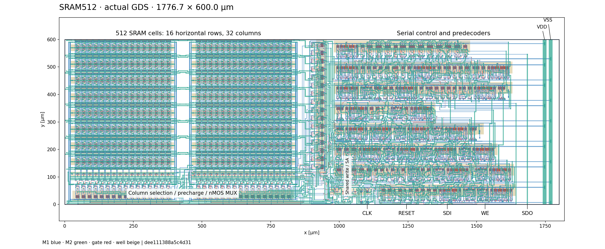

# 16行 × 32列・512 bit SRAM

**2026-09-12：保存GDSはDrawing DRC 0・厳密LVS一致・全IP62マスクDRC 0。ただし詳細RC試験でWLのLOW余裕とMOS端子間電圧が不合格となり、信号配線を修正中。製造提出可能な状態にはまだ達していない。**

提出候補は [`layout/sram512.gds`](layout/sram512.gds)。最上位は `sram512_macro`、
外形は **横1776.7 × 縦600.0 µm**、原点は左下 `(0, 0)`。
実際の製造マスクも同じ外形内に収まる。物理配置は16行×32列で、転置していない。
現GDSのSHA-256は `dee111388a5c4d3131b68772507706706d894248988ab761bf9c4070e9194e61`。



## 回路と操作

- ユーザーの `klayout/sram_pcell/` のsix_single版を使用。セルは22 × 29.6 µmピッチ、全MOSはW=3.4/L=1 µm。
- 16行・32列、512 bit。W=5.1/L=1 µmのnMOS列MUXと片側プルダウン書込み、共有7Tセンスアンプ。
- 32セル共通のWLを各行1個のAND3_X1から駆動。行4 bit、列5 bitの静的プリデコード。
- 受信とアクセスで同じ10 bitのフレームFFを使用。全体は21 FF。
- 外部7端子：VDD / VSS / CLK / RESET / SDI / WE / SDO。
- `RA3…RA0 CA4…CA0 DIN`を10クロックで送り、続く8クロックでアクセス。1操作18クロック。
- RESETはHIGHで非同期。メモリ内容を初期化する端子ではない。

詳細は[操作仕様](SPEC.md)。本体は `../sram512.sch`、専用TBは `../sram512_tb.sch`、
7端子の階層入口は `../sram512_macro.sch`。

## 検証状況

| 検証 | 結果 | 対象 |
|---|---|---|
| 回路図/ERC | 合格 | 512 bit専用回路とTB |
| 論理検証 | 334,063項目合格、9,270操作 | 全512アドレス、両データ、March C-、全18段階のRESET |
| 回路図のMOS基準・感度試験 | 変更後の9条件・26,109項目合格 | 5 V基準、電源・温度・容量・Vthの感度 |
| 回路図の行列カバレッジ | 136操作、38,901項目合格 | 全16行・全32列を通る34アドレス |
| 統合Drawing DRC / LVS | **0件 / 全14回路一致** | 現GDS、厳密な外部端子照合あり |
| 製造マスクDRC | **全項目0件** | 無改変devのMDP変換とIP62チェック |
| 物理配列・外形・端子 | 合格 | 512個の6Tセル、16行×32列、7端子、600×1800 µm以内 |
| 抽出後MOS・配線RC・電源・運用試験 | **実行中** | 現GDSから抽出した4,953 MOS＋8ダイオード |
| 抽出後の全行列カバレッジ | **38,901項目合格** | 現GDS、全16行・全32列、34アドレスで両データ、136操作。配線は集中容量モデル |
| 詳細信号RC＋実電源配線での最初のアクセス | **不合格・配線修正中** | 非選択WLのLOW余裕とC4B受信ゲートのVGB。RCの4分割・8分割でも再現 |
| 抽出後RC×3・4.5 V・85°C | **22,357項目合格** | 現GDS、周期5 µs、四隅への16操作、全RC分割点と21本のCLK枝 |
| 電源投入・RESET保持 | **32,729項目合格** | 現GDS、全MOS端子・全電源ビア、信号RCと実電源配線を含む1 µsの電源立上り |
| 高温での保持・非同期RESET | **5,429項目合格** | 現GDS、85°C、20 µs電源立上り、1 msクロック停止、10通りの割込み、28操作。配線は集中容量モデル |

列MUXを最小W=3.4 µmから5.1 µmへ変更した。旧寸法ではRC×3・4.5 V・85°Cの
遅いWL立ち上がりで書込みが失敗したためで、単にCLKを遅くしても解消しなかった。
旧結果は残し、列MUXのみの変更では端の1セルの1書込みがまだ不合格だったため、共有PDの2個も
W=10.2 µmへ変更した。問題のアドレス0について、全512セルを接続した0/1書込み・読出しが
100 ns／20 ns／5 nsの各最大刻みで5,551項目に合格した。
同じ低電圧・高温・RC×3条件で四隅を0/1それぞれ書いて読む全16操作も22,357項目に合格。
結果は `reports/pd102_rc3_low_hot_5us.json`。全行列・電源試験は継続中。
5 ns刻みの結果と、相対誤差を0.0001へ厳しくした20 ns刻みの結果は、
反転時刻の差が0.022 nsで一致した。数値収束の比較も合格している。
`reports/pd102_timestep_5_default_20_accurate.json` に比較値を記録した。

その後、実際のGC・コンタクト・M1・ビア・M2の分岐を保持し、全WLの各アクセスゲートを
個別接続したモデルで初回アクセスを確認したところ、非選択WLが約0.63 Vまで上昇し、
5 V時のLOW判定上限0.5 Vを超えた。また、C4Bを受けるOR2のPMOSで
|VGB|が約6.10 Vとなり、元のPDK資料の5.75 V上限を超えた。
書込みと全512セルの保持は合格したが、この状態ではリリースしない。
4分割と8分割のRCモデルでも同じ不合格が再現したため、WLの端部接続を増やし、
C4Bの長いポリ配線へ金属の並列経路を追加して再検証している。
詳細は `reports/pd102_signal_mesh4_prefix.json` と `reports/pd102_signal_mesh8_prefix.json`。
これらは初回アクセスの診断であり、連続16操作の合格に代用しない。

`startup_tests.py` は初期値を強制せず、0→5 Vの電源立上りにRESETを追従させる。
起動後は全WLがLOW、書込み駆動がOFF、全512セルが相補の保持状態に落ち着いた。
MOS端子間の最大電圧は5.233 V、個別ビアの最大瞬時電流は2.420 mAで、
各上限5.75 V／7.8 mA以内。ビアのRMS電流も0.78 mA以下。
電源投入時の各セルの0/1は仕様としては未定義であり、特定値への初期化は保証しない。

現配置の物理検証は `layout/drawing_lvs.json`、`layout/manufacturing.json`、
`layout/geometry_audit.json`。回路図のMOS試験は `reports/analog_pd102_*.json`。
過去の720 µm配置の結果を現GDSの合格根拠に流用していない。
過去の比較結果と不合格は[検討記録](EXPERIMENTS.md)に分けた。

## PDKとレイアウト上の変更

使用PDKは無改変のTR-1um dev、コミット `6afbd918951f2ea0dcd11c5a46986b4c20f9e6f9`。
`run.drc`、`run.lvs`、`run_mdp.drc`、`run_IP62.drc`をそのまま使用し、
waiver領域、端子無視、ブラックボックス化は使っていない。

PDKの設計側コピーでは、BUF_X4/GND等の欠落ラベルと一部ゲートの端子順を実MOS接続に
合わせて修正した。スタセルのGC/M1/M2に取り出し配線を追加し、個別のDRC/LVSも確認。
列選択ANDは共通AND2セルを子として、その外側に取り出し配線を持つ。
この階層整理の前後で製造図形のXORが空であることを検査している。

入力のDP/DNは各3.6 × 3.6 µmのまま。マスク間隔を確保するため、同じ小セル内で
DPをy=34.0、DNをy=13.05 µmへ移動し、周辺ウェルの下辺を調整した。
AND3の電源レールにある6個のウェル接点のうち端の1個を除き、残る5個を使うことで、
外側ウェルの余白を0.4 µm詰めた。MOSの位置・W/Lと論理接続は維持している。
これらは実レイアウトの変更であり、検査ルールや判定の変更ではない。

MDP出力には物理マスク以外に150/151等のデバイス認識図形も含まれる。
外形判定は公式MDPが出力する実マスク全層について行い、認識図形を含む全層外形も
JSONに記録する。認識図形は削除せず、公式DRCには全層を渡している。

## フレームとの接続

[端子座標](layout/ports.json)は最上位GDS上の実M2位置。
主催者がパッドへ配線し、共通フレームのESDを利用する前提。
コア内の小さなDP/DN対は浮遊ゲート検査に対応するもので、パッド用ESDの代替ではない。
SDOにはBUF_X4があり、検証負荷は10 pF。詳細はSPEC.mdを参照。

## 再検証

```bash
python3 sram512/verify_digital.py
python3 sram512/analog.py --matrix --name-prefix pd102 --jobs 1
python3 sram512/pcell_preservation.py  # 元のPCellと提出GDS内のセルの全層XOR
python3 sram512/verify_saved_layout.py  # 保存GDSを現在の回路図へ照合し、DRC/LVS・マスクを再検証
python3 sram512/geometry_audit.py build/sram512/layout/final16x32_pd10p2 --require-origin
python3 sram512/manufacturing.py build/sram512/layout/final16x32_pd10p2
python3 sram512/postlayout.py build/sram512/layout/final16x32_pd10p2 --name pd102_decode_coverage --decode-coverage --solver klu
python3 sram512/postlayout.py build/sram512/layout/final16x32_pd10p2 --name pd102_rc3_low_hot_5us --rc-scale 3 --vdd 4.5 --temperature 85 --period 5000 --solver klu
python3 sram512/postlayout.py build/sram512/layout/final16x32_pd10p2 --name pd102_power_paths_reset_high --rc-scale 1 --physical-gate-paths --power-sheet 0.1 --power-mesh-grid 0.25 --voltage-envelope --initial-reset-high --period 5000 --solver klu
python3 sram512/startup_tests.py build/sram512/layout/final16x32_pd10p2 --name pd102_startup_5n
python3 sram512/startup_tests.py build/sram512/layout/final16x32_pd10p2 --name pd102_startup_1n --max-step-ns 1
python3 sram512/startup_tests.py build/sram512/layout/final16x32_pd10p2 --name pd102_startup_klu_pivot --solver klu --pivrel 0.1
python3 sram512/startup_tests.py build/sram512/layout/final16x32_pd10p2 --name pd102_startup_stream --solver klu --pivrel 0.1 --stream
python3 sram512/startup_summary.py
python3 sram512/postlayout.py build/sram512/layout/final16x32_pd10p2 --name pd102_power_paths_ramp --rc-scale 1 --physical-gate-paths --power-sheet 0.1 --power-mesh-grid 0.25 --voltage-envelope --startup-ramp-ns 1000 --period 5000 --solver klu --pivrel 0.1 --stream
python3 sram512/operational_tests.py build/sram512/layout/final16x32_pd10p2 --name pd102_operational_hot --solver klu --pivrel 0.1 --stream
```

`--stream`を付けた抽出後試験は、ngspiceの標準バッチraw出力で各計算点を
直接ファイルへ保存する。メモリ内に全波形をため込まず、同じPython検査を行う。
ケース固有のbuildディレクトリ内にだけ`.spiceinit`を作り、1スレッドを指定する。
起動試験で8,863電圧ノード・全時刻が従来方式と完全一致した。

大きな波形と再生成物は `build/sram512/` に置き、Gitへは入れない。
GUIでTBを開く場合は `python3 sram512/open.py`。
RC係数は明記した感度試験用の仮定であり、校正済みファウンドリPEXではない。
512 bit用の解析は `set num_threads=1` をTB内で指定し、複数ケース実行時の
過剰なOpenMPスレッド生成を避ける。起動区間ではKLUの`pivrel=0.1`とSparseが
全8,863ノードで最大約13 nVの差で一致した。ただし、その後のプリチャージ区間は
Sparseの方が速く、詳細信号RCの再検証にはSparseと既定の台形積分・誤差許容値を用いる。
システムのspinitやPDKは変更しない。
温度・電源・Vth感度の合格を、統計的な製造ばらつきや歩留まりの保証と取り違えない。

抽出後の必須4試験は`python3 sram512/verification_jobs.py start`で実行し、
`python3 sram512/verification_jobs.py status`で状態を確認できる。デスクトップの
終了に依存しない個別プロセスとして実行し、PID・コマンド・結果をbuild内へ記録する。
VM再起動時は実行途中の解析を継続できないので、未完了フォルダを残して再実行する。
保存済みの合格結果と同じGDSの試験はスキップし、残る試験だけ実行する。

提出ファイルの収集は `python3 sram512/package.py --draft`。回路図の依存ファイル、
GDS、端子座標、仕様書、検証結果、ファイルごとのSHA-256をレビュー用ZIPへまとめる。
別フォルダへ展開した本体とTBでもERCとネットリスト生成を確認した。
`--draft`を外した製造コア用の梱包は、必須結果が全件合格し、GDSとPDKが一致する
場合だけ行える。ZIPは `build/sram512/submission/` に生成し、外部へは送信しない。
